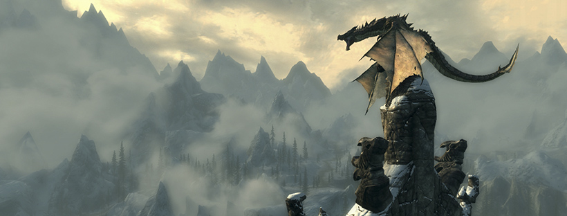

A guide on how to **install mods** in **Skyrim** on PC. We've also included instructions on how to use mod managers like [Vortex](https://www.nexusmods.com/about/vortex/) and trusted mod websites like [Nexus Mods](https://www.nexusmods.com/skyrim).

This guide is focused on **Windows users**, but some concepts can be adapted for Linux with tools like Steam Proton and [Wine](https://www.winehq.org/)!

Skyrim is one of the most modded games of all time. Whether you're looking to enhance graphics, add new quests, improve combat, or create an entirely new gameplay experience, this guide will help you get started safely and efficiently!

## Table Of Contents
* [Requirements](#requirements)
* [Game Version Notes](#game-version-notes)
* [Backup Your Game Files!](#backup-your-game-files)
* [Install Vortex Mod Manager](#install-vortex-mod-manager)
* [Where To Download Mods](#where-to-download-mods)
* [Installing Mods Through Vortex](#installing-mods-through-vortex)
* [Manual Mod Installation (Advanced)](#manual-mod-installation-advanced)
* [LOOT - Load Order Optimization Tool](#loot---load-order-optimization-tool)
* [Script Extenders (SKSE)](#script-extenders-skse)
* [Conclusion](#conclusion)
* [See Also](#see-also)

## Requirements
* Skyrim (either the original or Special Edition) installed on your PC
* A Nexus Mods account (free)
* [7-Zip](https://www.7-zip.org/) or any archive extraction software
* Basic understanding of copying/moving files on Windows
* An internet connection

## Game Version Notes
There are two primary versions of Skyrim you'll likely run into:

### 1. Skyrim Legendary Edition (Oldrim)
* Released in 2011  
* 32-bit  
* Named "The Elder Scrolls V: Skyrim" on Steam  
* Uses `Skyrim.exe`

### 2. Skyrim Special Edition (SSE) 
* Released in 2016  
* 64-bit  
* Improved performance, mod support  
* Named "Skyrim Special Edition" on Steam  
* Uses `SkyrimSE.exe`

Most modern mods target **Skyrim Special Edition**. Vortex can detect both versions automatically, but always make sure to download mods compatible with your specific version.

### If you're using a non-Steam version (e.g. GOG)  
Vortex and mod support work similarly, but you’ll need to manually tell Vortex where your game is installed. Some mods or tools like SKSE may not fully support GOG versions.

## Backup Your Game Files!
Before modding Skyrim, it's highly recommended to **back up** your installation in case a mod breaks something.

You can do this by performing the following.

* Copying your entire Skyrim folder (`Skyrim` or `Skyrim Special Edition`) to another location on your drive.
* Backing up your save files:
    * Found in: `Documents\My Games\Skyrim\Saves`

This ensures you can restore from a backup if a mod causes issues.

## Install Vortex Mod Manager
[Vortex](https://www.nexusmods.com/about/vortex/) is the recommended mod manager developed by [Nexus Mods](https://www.nexusmods.com/skyrim).

Here are steps to download, launch, and configure the tool.

1. Download Vortex from [here](https://www.nexusmods.com/site/mods/1?tab=files).

2. Run the installer and follow the instructions.

3. On first launch, it will ask to scan for supported games. Confirm it detects Skyrim or Skyrim SE.

4. If Skyrim is not detected, perform the following steps.
    1. Click the `Games` tab.
    2. Find Skyrim, hover over the icon, and click `Manage`.
    3. Manually set the file path to your `Skyrim.exe` or `SkyrimSE.exe`.

## Where To Download Mods
The main source for Skyrim mods is [Nexus Mods](https://www.nexusmods.com/skyrim) or [Nexus Mods - SSE](https://www.nexusmods.com/skyrimspecialedition).

Other (less common) websites include the following.
* [LoversLab](https://www.loverslab.com/)
* [AFK Mods](https://www.afkmods.com/)
* [ModDB](https://www.moddb.com/games/the-elder-scrolls-v-skyrim)

**NOTE** - Always read the mod description and user posts before installing any mod. Some mods have special requirements or installation instructions!

## Installing Mods Through Vortex
1. Login to your Nexus Mods account in your browser.
2. Go to the mod page you want to install.
3. Click the **Mod Manager Download** button.
4. The file should open in Vortex automatically.
5. In Vortex:
    1. Go to the `Mods` tab.
    2. Enable the mod.
    3. Click `Deploy Mods` if prompted.

The mod should now be loaded the next time you launch Skyrim!

## Manual Mod Installation (Advanced)

While Vortex is recommended, you can manually install simple mods.

Here are tbe steps do so.

1. Download the mod manually from Nexus Mods.
2. Extract the archive with 7-Zip.
3. Copy contents to your Skyrim `Data` folder:
    * Usually found at: `C:\Program Files (x86)\Steam\steamapps\common\Skyrim\Data`
4. Enable the plugin (`.esp` or `.esm`) using Skyrim's built-in launcher or a load order tool like LOOT.

**NOTE** - Always read the mod's installation notes. Some require more advanced steps or external scripts.

## LOOT (Load Order Optimization Tool)
There are some Skyrim mods that must be loaded in a specific order. Use [LOOT](https://loot.github.io/) to automatically sort the mod/plugin order which should help prevent potential issues.

Here are steps on how to download and use LOOT.

1. Download LOOT from [here](https://loot.github.io/).
2. Install and run LOOT.
3. Click the "Sort Plugins" button.
4. Apply the changes.

**NOTE** - You can launch LOOT from within Vortex as well.

## Script Extenders (SKSE)
There are some Skyrim mods that require the **Skyrim Script Extender (SKSE or SKSE64)** to function.

Here are steps on how to download and use SKSE.

1. Download SKSE for your Skyrim version from [here](https://skse.silverlock.org/).

2. Extract the contents of the downloaded file.

3. Copy these files into your Skyrim folder.
    * `skse64_loader.exe`
    * `skse64_1_5_97.dll` (or whatever version you're using)
    * `skse64_steam_loader.dll`

4. Always run the game using `skse64_loader.exe` (**not** `SkyrimSE.exe`).

5. You can create a shortcut or add it to Vortex as a custom executable.

**NOTE** - If you update Skyrim via Steam, you may need to redownload SKSE to match the new version.

## Conclusion
By now, you should know how to do the following!

* Back up your game.
* Install and use Vortex.
* Download and install mods for Skyrim.
* Use tools like LOOT and SKSE.

## See Also
* [Nexus Mods - Skyrim SE](https://www.nexusmods.com/skyrimspecialedition)
* [Vortex Mod Manager Guide](https://wiki.nexusmods.com/index.php/Vortex)
* [SKSE](https://skse.silverlock.org/)
* [LOOT](https://loot.github.io/)
* [Skyrim Modding Subreddit](https://www.reddit.com/r/skyrimmods/)
* [Skyrim Modding Discords](https://discord.com/invite/skyrim)

This guide is a *work-in-progress* and will be updated over time. If you have feedback or suggestions, feel free to reach out!